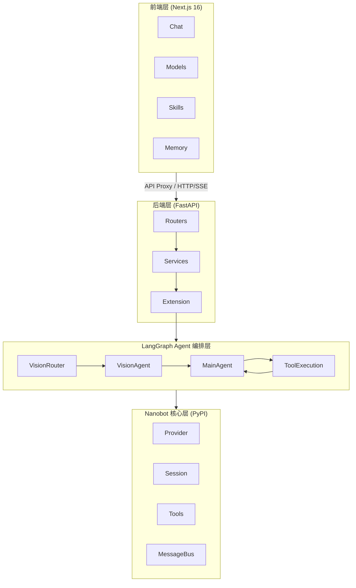
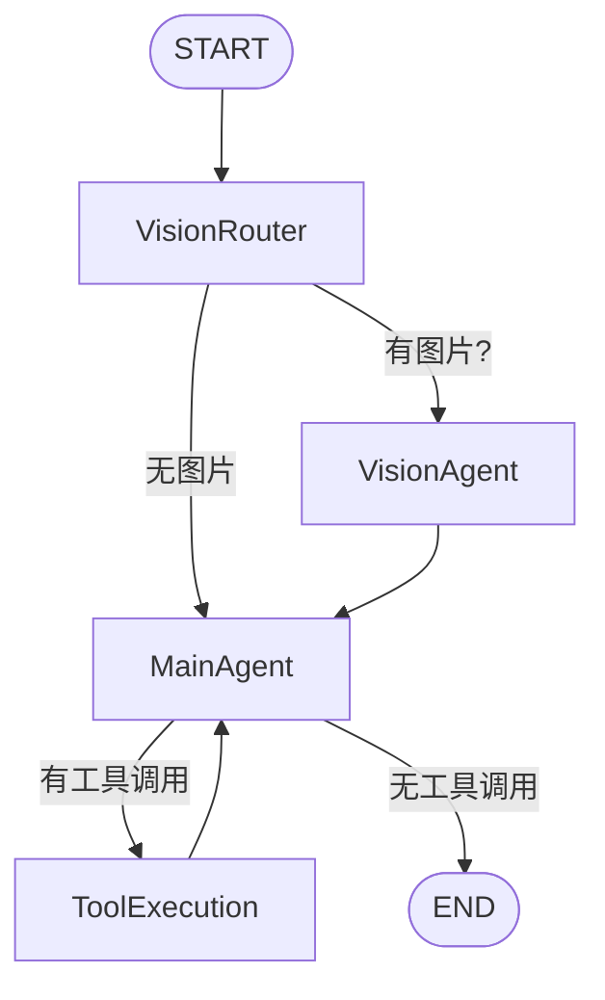

# VersaClaw

<div align="center">
  <h3>基于 Nanobot 的多模态 Multi-Agent 平台</h3>
  <p>通过 LangGraph 实现智能 Agent 编排，支持图像理解、任务拆解、多 Agent 协作</p>

  <p>
    
    
    
    
    
    
  </p>
</div>

---

## 简介

**VersaClaw** 是基于 [Nanobot](https://github.com/HKUDS/nanobot)（港大开源轻量级 AI Agent）构建的多模态 Multi-Agent 平台。通过 LangGraph 实现 Agent 编排，支持图像理解、任务拆解、多 Agent 协作等高级能力。

### 核心特性

- 🎯 **Multi-Agent 编排** - 基于 LangGraph 的状态图编排，支持视觉路由、工具执行、Agent Team
- 🖼️ **多模态支持** - 图片上传与 Vision 模型（GPT-4o、Claude、Gemini 等）
- 🔄 **智能模型调度** - 根据请求特征自动选择最优模型
- 🚀 **实时流式输出** - SSE 支持，实时显示 AI 响应和推理过程
- 🔧 **15+ LLM 提供商** - 支持国内外主流模型
- 🐳 **容器化部署** - Docker 一键部署

---

## 架构概览

### 整体架构



### Agent 执行流程



**核心组件**:

| 组件 | 文件 | 职责 |
|------|------|------|
| **VisionRouter** | `langgraph/nodes/vision_router.py` | 判断是否需要视觉处理 |
| **VisionAgent** | `langgraph/nodes/vision_agent.py` | 图片理解与分析 |
| **MainAgent** | `langgraph/nodes/main_agent.py` | 核心对话与任务规划 |
| **ToolExecution** | `langgraph/nodes/tool_execution.py` | 工具调用执行 |
| **AgentTeamManager** | `langgraph/team/manager.py` | 多 Agent 团队管理 |
| **ModelScheduler** | `extension/scheduler.py` | 智能模型选择 |

---

## 快速开始

### Docker 一键部署（推荐）

```bash
# 克隆仓库
git clone https://github.com/SeanXu98/VersaClaw.git
cd VersaClaw

# 启动服务
docker compose up -d

# 访问应用
# 前端: http://localhost:5000
# 后端: http://localhost:18790
# API文档: http://localhost:18790/docs
```

### 手动启动

```bash
# 后端
cd backend
pip install -r requirements.txt
python api_server.py

# 前端
cd frontend
npm install
npm run dev
```

---

## 项目结构

```
VersaClaw/
├── frontend/                    # Next.js 16 前端
│   ├── app/                     # 页面 (Chat, Models, Skills, Memory)
│   ├── components/              # React 组件 (RightPanel, ImageUploader)
│   └── lib/nanobot/             # Nanobot 文件访问层
│
├── backend/                     # Python 后端
│   ├── app/
│   │   ├── langgraph/           # LangGraph Agent 编排
│   │   │   ├── graph.py         # 图构建器
│   │   │   ├── state.py         # 状态定义
│   │   │   ├── nodes/           # Agent 节点
│   │   │   └── team/            # Agent Team 管理
│   │   ├── extension/           # 扩展模块
│   │   │   ├── scheduler.py     # 模型调度器
│   │   │   ├── enhanced_loop.py # 增强Agent循环
│   │   │   └── vision_*.py      # 视觉处理
│   │   ├── routers/             # API 路由
│   │   └── services/            # 业务服务
│   └── api_server.py            # 服务入口
│
└── docker-compose.yml           # Docker 配置
```

---

## API 端点

### 核心接口

| 方法 | 路径 | 说明 |
|------|------|------|
| `POST` | `/api/chat/stream` | 流式对话（支持图片） |
| `GET` | `/api/sessions` | 会话列表 |
| `POST` | `/api/upload/image` | 图片上传 |
| `GET` | `/api/models/available` | 可用模型 |

### SSE 事件类型

| 事件 | 说明 |
|------|------|
| `content` | 文本内容 |
| `reasoning` | 推理过程 |
| `tool_call_start` | 工具调用开始 |
| `tool_call_end` | 工具调用结束 |
| `done` | 完成 |

完整 API 文档: http://localhost:18790/docs

---

## 配置

### 环境变量

| 变量 | 说明 | 默认值 |
|------|------|--------|
| `NANOBOT_HOME` | 配置目录 | `~/.nanobot` |
| `NANOBOT_API_PORT` | 后端端口 | `18790` |

### Agent 配置 (`~/.nanobot/config.json`)

```json
{
  "agents": {
    "defaults": {
      "model": "anthropic/claude-3-5-sonnet",
      "imageModel": {
        "primary": "gpt-4o",
        "fallbacks": ["claude-3-sonnet"],
        "autoSwitch": true
      },
      "agentTeam": {
        "enabled": true,
        "maxParallelAgents": 3,
        "defaultCoordinationMode": "parallel",
        "defaultAggregationStrategy": "combine",
        "timeout": 300
      },
      "langgraph": {
        "enabled": true,
        "maxIterations": 40
      }
    }
  }
}
```

---

## 路线图

### v0.2.x (已完成)
- [x] LangGraph Agent 编排
- [x] 视觉路由与图片理解
- [x] Agent Team 多代理协作
- [x] 智能模型调度

### v0.3.x (规划中)
- [ ] 语音输入/输出
- [ ] 视频理解
- [ ] 文件上传处理

---

## 相关项目

- [Nanobot](https://github.com/HKUDS/nanobot) - 港大开源轻量级 AI Agent
- [LangGraph](https://github.com/langchain-ai/langgraph) - LangChain Agent 编排框架

---

## License

MIT License