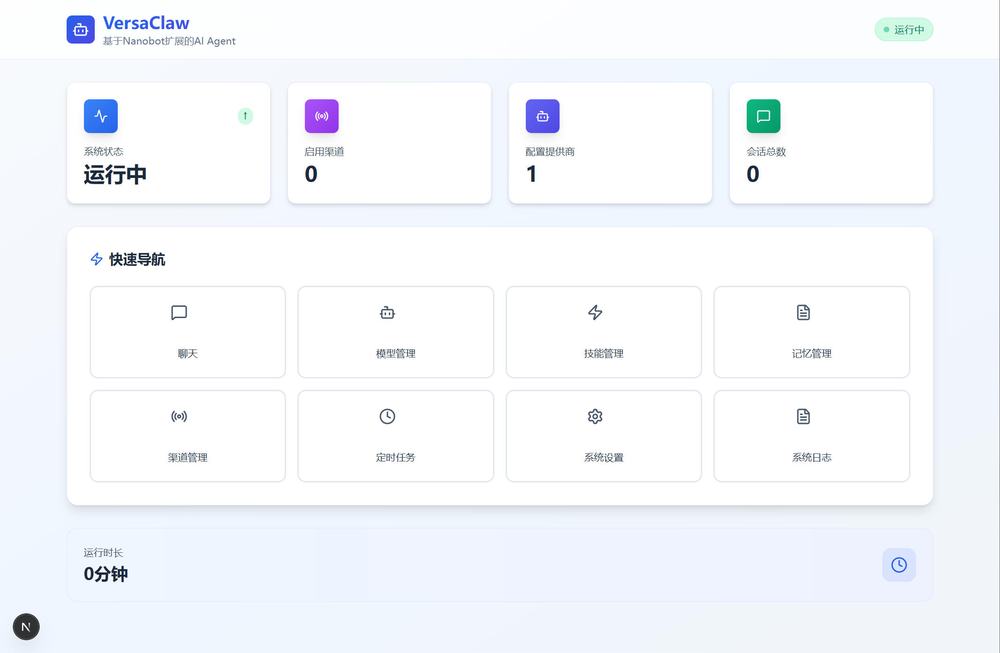
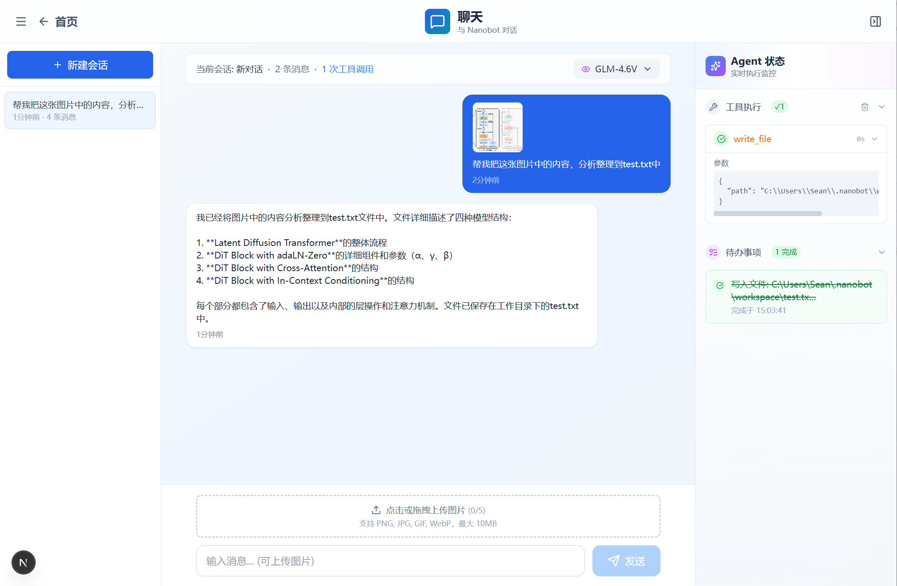
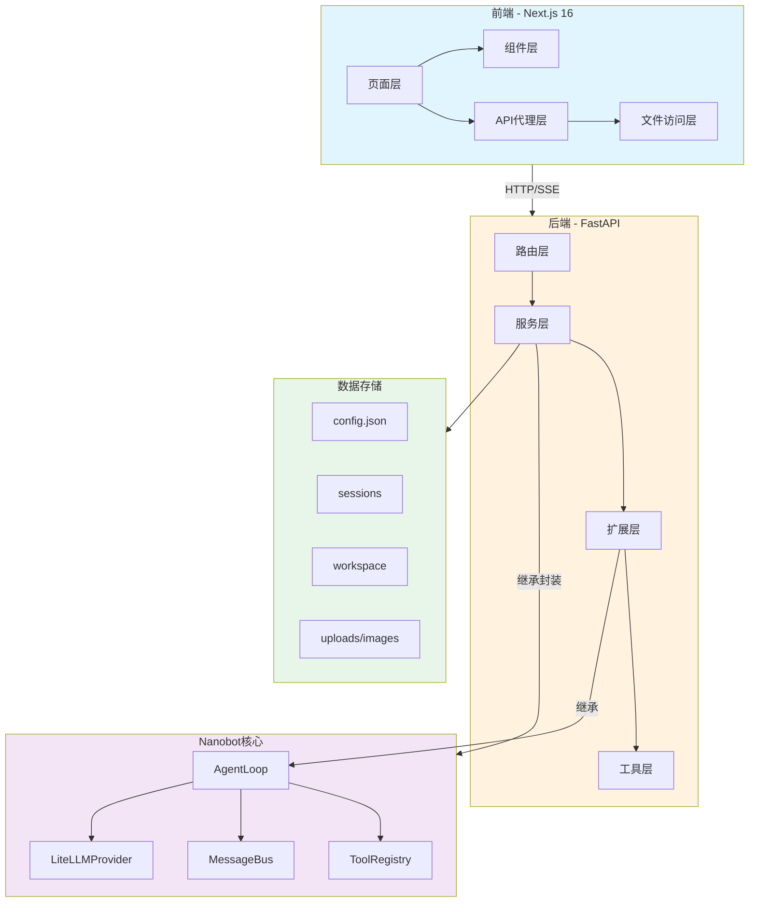
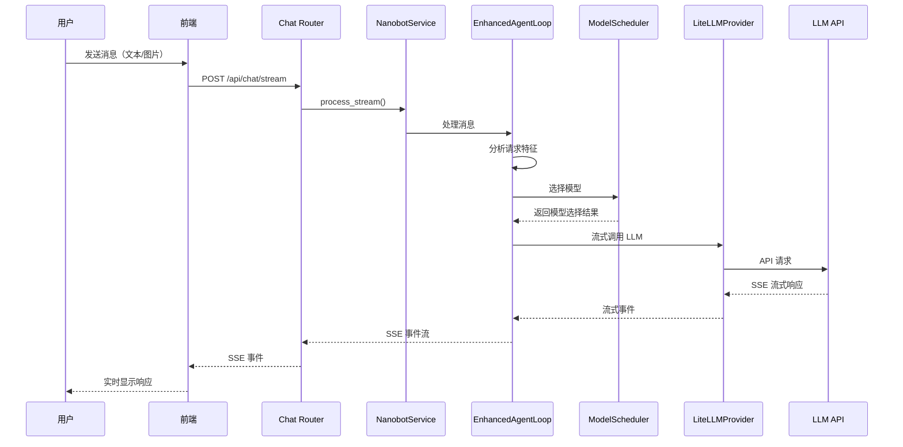
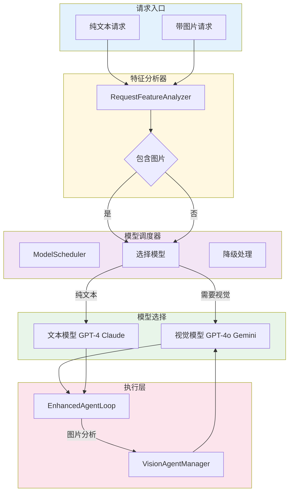
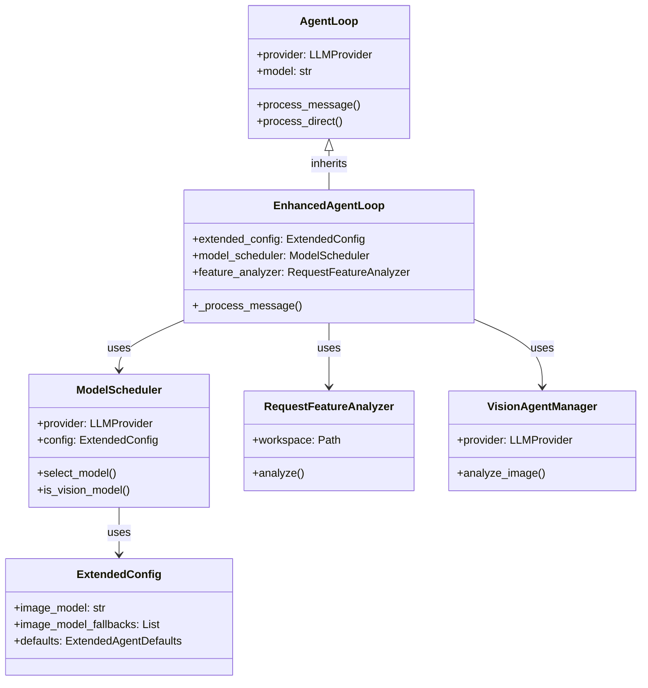
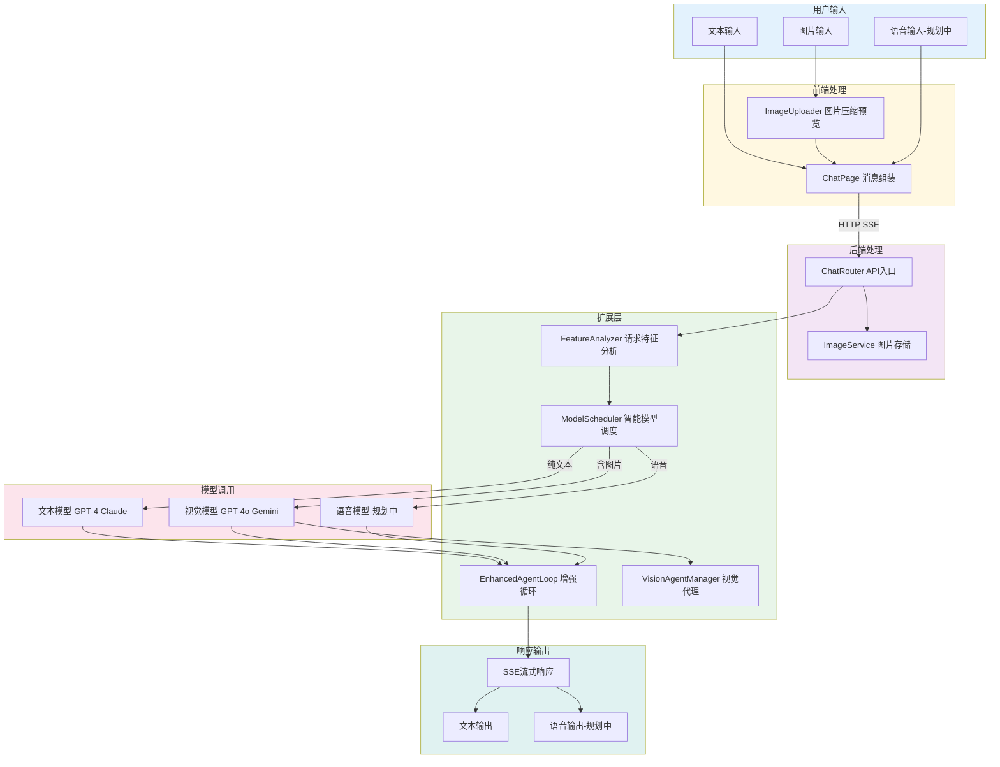

# VersaClaw

<div align="center">
  <h3>基于Nanobot实现的 AI Agent</h3>
  <p>基于 <a href="https://github.com/HKUDS/nanobot">Nanobot</a> 的AI Agent，具备现代化 Web 管理界面，未来将支持图像、语音、视频等多模态交互</p>

  <p>
    
    
    
    
    
    
    
    
  </p>
</div>

---

## 简介

**VersaClaw** (/ˈvɜːrsə klɔː/) 是基于 [Nanobot](https://github.com/HKUDS/nanobot)（港大开源的轻量级 AI Agent）开发的Agent。

它提供了友好的 Web 界面来配置 LLM 提供商、管理会话、与 AI 进行对话交互，无需修改 Nanobot 源码即可实现完整的可视化管理。未来将支持语音、图像等多模态交互能力。




### 核心特性

- 🎯 **一体化管理** - 前后端集成，开箱即用
- 📦 **简洁依赖** - 通过 PyPI 引用 nanobot-ai，代码更精简
- 🐳 **容器化部署** - 支持 Docker 一键部署
- 🚀 **实时流式输出** - SSE 支持，实时显示 AI 响应和推理过程
- 🔧 **灵活配置** - 支持 15+ LLM 提供商，包括国内外主流模型
- 🎨 **现代化 UI** - Glass-morphism 设计风格，响应式布局
- 🖼️ **多模态支持** - 已支持图片上传和 Vision 模型（GPT-4o、Claude、Gemini 等）
- 🤖 **Agent 执行面板** - 实时显示工具调用、待办事项和执行状态

---

## 架构概览

### 整体架构



### 核心数据流



### 多模态处理架构



### 扩展层模块关系



### 核心模块说明

#### 前端模块 (Frontend)

| 模块 | 文件 | 功能 |
|------|------|------|
| **Chat Page** | `app/chat/page.tsx` | 聊天页面，支持流式响应、多模态消息、模型选择 |
| **Models Page** | `app/models/page.tsx` | 模型管理页面，配置 LLM 提供商，支持 Vision 模型标识 |
| **Skills Page** | `app/skills/page.tsx` | 技能管理页面，编辑 SKILL.md |
| **Memory Page** | `app/memory/page.tsx` | 记忆管理页面，查看长期记忆 |
| **Channels Page** | `app/channels/page.tsx` | 渠道管理页面，IM平台集成 |
| **Cron Page** | `app/cron/page.tsx` | 定时任务页面，任务调度管理 |
| **Settings Page** | `app/settings/page.tsx` | 系统设置页面 |
| **Right Panel** | `components/RightPanel.tsx` | Agent 执行面板，显示工具调用、待办事项和执行状态 |
| **Image Uploader** | `components/ImageUploader.tsx` | 图片上传组件，支持拖拽、多图上传、预览 |
| **Nanobot Lib** | `lib/nanobot/` | Nanobot 文件系统访问层（配置、会话、技能等） |
| **Model Utils** | `utils/model.ts` | Vision 模型检测工具函数 |
| **Type Definitions** | `types/nanobot.ts` | 完整的 TypeScript 类型定义（含多模态） |

#### 后端模块 (Backend)

| 层级 | 模块 | 文件 | 功能 |
|------|------|------|------|
| **入口** | API Server | `api_server.py` | FastAPI 服务入口 |
| **入口** | Stream Processor | `stream_processor.py` | SSE 流式处理封装 |
| **应用** | Main App | `app/main.py` | FastAPI 应用工厂，配置中间件和路由 |
| **应用** | Config | `app/config.py` | 应用配置和 Provider 元数据 |
| **应用** | Dependencies | `app/dependencies.py` | 依赖注入（服务实例获取） |
| **路由** | Chat Router | `app/routers/chat.py` | 聊天 API（流式/非流式，支持多模态） |
| **路由** | Sessions Router | `app/routers/sessions.py` | 会话管理 API |
| **路由** | Images Router | `app/routers/images.py` | 图片上传 API |
| **路由** | Models Router | `app/routers/models.py` | Provider 管理 API |
| **路由** | Config Router | `app/routers/config.py` | 配置管理 API |
| **服务** | Nanobot Service | `app/services/nanobot_service.py` | Nanobot 生命周期管理，集成 EnhancedAgentLoop |
| **服务** | Image Service | `app/services/image_service.py` | 图片处理服务，缩略图生成 |
| **扩展** | Model Scheduler | `app/extension/scheduler.py` | 智能模型调度器，支持模型选择和降级 |
| **扩展** | Enhanced Agent Loop | `app/extension/enhanced_loop.py` | 增强的 Agent 循环，继承 AgentLoop，支持多模态 |
| **扩展** | Feature Analyzer | `app/extension/feature_analyzer.py` | 请求特征分析器，检测图片、判断任务类型 |
| **扩展** | Vision Agent | `app/extension/vision_agent.py` | 视觉代理配置和类型定义 |
| **扩展** | Vision Agent Manager | `app/extension/vision_agent_manager.py` | Vision Agent 管理器，执行图片分析 |
| **扩展** | Config Extension | `app/extension/config_extension.py` | 扩展配置，支持独立的 imageModel 配置 |
| **工具** | Vision Utils | `app/utils/vision.py` | Vision 模型检测 |
| **工具** | Helpers | `app/utils/helpers.py` | 通用工具函数 |

---

## 目录

- [功能特性](#功能特性)
- [技术栈](#技术栈)
- [快速开始](#快速开始)
  - [Docker 一键部署（推荐）](#docker-一键部署推荐)
  - [单独启动前后端](#单独启动前后端)
- [配置说明](#配置说明)
- [项目结构](#项目结构)
- [API 文档](#api-文档)
- [开发指南](#开发指南)
- [路线图](#路线图)
- [常见问题](#常见问题)

---

## 功能特性

### 前端功能

- **仪表板** - 系统状态概览、快速导航
- **模型管理** - 15+ LLM 提供商配置，支持 Vision 模型标识
  - 网关：OpenRouter、AIHubMix、Custom
  - 国际：Anthropic、OpenAI、DeepSeek、Groq、Gemini
  - 国内：通义千问、Moonshot/Kimi、智谱GLM、MiniMax
  - 本地：vLLM
- **聊天界面** - 类 ChatGPT 的对话体验
  - 会话管理（新建、切换、删除）
  - 模型选择（支持 Vision 模型）
  - 实时流式输出（SSE）
  - 推理过程展示（DeepSeek-R1 等思考模型）
  - 工具调用可视化
  - **图片上传与预览**（Vision 模型）
  - Agent 执行状态面板
- **技能管理** - 自定义技能 SKILL.md 编辑
- **记忆管理** - 长期记忆和历史日志查看
- **渠道管理** - IM 平台集成（Telegram、Discord、Slack 等）
- **定时任务** - Cron 任务调度

### 后端功能

- **FastAPI 服务** - 高性能异步 API
- **SSE 流式响应** - 实时推送 AI 响应
- **多模态支持** - 图片上传、处理、Vision 模型调用
- **会话管理** - 创建、读取、删除会话
- **配置热重载** - 无需重启更新配置
- **健康检查** - 服务状态监控
- **图片存储** - 本地文件存储 + 缩略图生成

---

## 技术栈

### 前端 (`frontend/`)
- **框架**: Next.js 16 (App Router) + React 19
- **语言**: TypeScript 5.x
- **样式**: Tailwind CSS 3.4
- **图标**: Lucide React
- **状态管理**: React Hooks + useState/useEffect
- **HTTP 客户端**: Fetch API + SSE (EventSource)

### 后端 (`backend/`)
- **框架**: FastAPI + Uvicorn
- **核心**: [nanobot-ai](https://pypi.org/project/nanobot-ai/) (PyPI)
- **LLM 集成**: LiteLLM（支持 100+ 模型）
- **图片处理**: Pillow（缩略图生成）
- **异步支持**: asyncio + aiofiles

### 部署
- **容器**: Docker + Docker Compose
- **数据持久化**: Volume 挂载 (~/.nanobot/)
- **健康检查**: HTTP Health Check Endpoint

---

## 快速开始

### 前置条件

1. **Docker 部署**（推荐）
   - Docker 20.10+
   - Docker Compose 2.0+

2. **手动部署**
   - Node.js 18+
   - Python 3.11+

---

### Docker 一键部署（推荐）

这是最简单的部署方式，适合快速体验和生产环境使用。

#### 1. 克隆仓库

```bash
git clone https://github.com/SeanXu98/VersaClaw.git
cd VersaClaw
```

#### 2. 一键启动

```bash
# 构建并启动所有服务
docker compose up -d

# 查看日志
docker compose logs -f
```

#### 3. 访问应用

- **前端界面**: http://localhost:5000
- **后端 API**: http://localhost:18790
- **API 文档**: http://localhost:18790/docs
- **健康检查**: http://localhost:18790/health

#### 4. 停止服务

```bash
docker compose down
```

#### 数据持久化

默认使用 Docker Volume 存储数据。如需使用主机目录：

```yaml
# 编辑 docker-compose.yml，将 volumes 部分改为：
volumes:
  - ~/.nanobot:/root/.nanobot
```

#### Docker 目录映射说明

默认配置下，容器的目录映射关系如下：

| 容器内路径 | 本地路径 | 存储内容 |
|-----------|---------|---------|
| `/app` | 无映射（镜像内） | 后端代码运行目录 |
| `/root/.nanobot` | Docker Volume | Nanobot 配置和数据 |
| `/root/.nanobot/config.json` | Docker Volume | LLM 提供商配置（API Key 等） |
| `/root/.nanobot/sessions/` | Docker Volume | 会话历史记录 |
| `/root/.nanobot/workspace/` | Docker Volume | 技能和记忆文件 |
| `/root/.nanobot/uploads/images/` | Docker Volume | 上传的图片文件 |

**使用本地目录映射的好处：**
- 直接在本地查看和编辑配置文件
- 方便数据备份和迁移
- 便于调试和开发

**切换到本地目录映射：**

1. 修改 `docker-compose.yml` 中的 backend 服务配置：
```yaml
services:
  backend:
    # ...
    volumes:
      # 注释掉 Docker Volume
      # - versaclaw-data:/root/.nanobot
      # 使用本地目录映射
      - ~/.nanobot:/root/.nanobot
```

2. 重新创建容器：
```bash
docker compose down
docker compose up -d
```

---

### 单独启动前后端

适合开发调试或需要独立部署的场景。

#### 方式一：启动后端服务

```bash
# 进入后端目录
cd backend

# 安装 Python 依赖（会自动安装 nanobot-ai）
pip install -r requirements.txt

# 启动后端服务
python api_server.py

# 或使用 uvicorn
uvicorn api_server:app --host 0.0.0.0 --port 18790
```

后端服务将在 http://localhost:18790 启动。

#### 方式二：启动前端服务

```bash
# 进入前端目录
cd frontend

# 安装依赖
npm install

# 配置环境变量（可选）
cp ../.env.local.example .env.local
# 编辑 .env.local，设置 NANOBOT_API_URL=http://localhost:18790

# 开发模式
npm run dev

# 或生产模式
npm run build
npm start
```

前端服务将在 http://localhost:5000 启动。

#### 单独使用 Docker 镜像

**构建镜像：**

```bash
# 在项目根目录执行
docker build -f Dockerfile.backend -t versaclaw-backend .
docker build -f Dockerfile.frontend -t versaclaw-frontend .
```

**运行容器：**

```bash
# 运行后端
docker run -d \
  --name versaclaw-backend \
  -p 18790:18790 \
  -v ~/.nanobot:/root/.nanobot \
  versaclaw-backend

# 运行前端
docker run -d \
  --name versaclaw-frontend \
  -p 5000:5000 \
  -e NANOBOT_API_URL=http://host.docker.internal:18790 \
  versaclaw-frontend
```

---

## 配置说明

### 环境变量

| 变量 | 说明 | 默认值 |
|------|------|--------|
| `NANOBOT_HOME` | Nanobot 配置目录 | `~/.nanobot` |
| `NANOBOT_API_URL` | 后端 API 地址 | `http://localhost:18790` |
| `NANOBOT_API_HOST` | 后端监听地址 | `0.0.0.0` |
| `NANOBOT_API_PORT` | 后端端口 | `18790` |
| `NEXT_PUBLIC_APP_NAME` | 应用名称 | VersaClaw |

### Nanobot 配置

首次使用需要初始化 Nanobot 配置：

```bash
# 安装 nanobot-ai
pip install nanobot-ai

# 初始化配置
nanobot onboard

# 配置文件位置
~/.nanobot/config.json
```

---

## 项目结构

```
VersaClaw/
├── frontend/                    # 前端项目 (Next.js 16)
│   ├── app/                     # 页面和 API 路由 (App Router)
│   │   ├── api/                 # API 代理层
│   │   │   ├── chat/            # 聊天相关 API
│   │   │   │   ├── stream/      # SSE 流式聊天
│   │   │   │   └── sessions/    # 会话管理
│   │   │   ├── models/          # 模型管理 API
│   │   │   │   ├── available/   # 获取可用模型
│   │   │   │   └── providers/   # 提供商配置
│   │   │   ├── skills/          # 技能管理 API
│   │   │   ├── memory/          # 记忆管理 API
│   │   │   ├── channels/        # 渠道管理 API
│   │   │   ├── cron/            # 定时任务 API
│   │   │   ├── system/          # 系统状态 API
│   │   │   │   ├── config/      # 配置 API
│   │   │   │   └── status/      # 状态 API
│   │   │   └── upload/          # 图片上传 API
│   │   │       └── image/       # 图片上传处理
│   │   ├── chat/                # 聊天页面
│   │   ├── models/              # 模型管理页面
│   │   ├── skills/              # 技能管理页面
│   │   ├── memory/              # 记忆管理页面
│   │   ├── channels/            # 渠道管理页面
│   │   ├── cron/                # 定时任务页面
│   │   ├── settings/            # 系统设置页面
│   │   └── page.tsx             # 仪表板主页
│   ├── components/              # React 组件
│   │   ├── RightPanel.tsx       # Agent 执行面板
│   │   └── ImageUploader.tsx    # 图片上传组件
│   ├── lib/                     # 工具函数库
│   │   └── nanobot/             # Nanobot 文件系统访问层
│   ├── utils/                   # 工具函数
│   │   └── model.ts             # 模型相关工具（Vision 检测等）
│   ├── types/                   # TypeScript 类型定义
│   │   └── nanobot.ts           # 完整类型定义（含多模态）
│   ├── package.json             # Node.js 配置
│   ├── next.config.js           # Next.js 配置
│   └── tailwind.config.ts       # Tailwind 配置
│
├── backend/                     # 后端项目 (Python 3.11+)
│   ├── api_server.py            # FastAPI 服务入口
│   ├── stream_processor.py      # SSE 流式处理封装
│   ├── requirements.txt         # Python 依赖
│   └── app/                     # 应用模块包
│       ├── __init__.py          # 包初始化
│       ├── main.py              # FastAPI 应用工厂
│       ├── config.py            # 配置管理（含 Provider 元数据）
│       ├── dependencies.py      # 依赖注入
│       ├── models/              # 数据模型
│       │   ├── __init__.py
│       │   └── schemas.py       # Pydantic 请求/响应模型
│       ├── routers/             # API 路由
│       │   ├── __init__.py
│       │   ├── chat.py          # 聊天 API（流式/非流式）
│       │   ├── sessions.py      # 会话管理 API
│       │   ├── images.py        # 图片上传 API
│       │   ├── models.py        # Provider 管理 API
│       │   └── config.py        # 配置管理 API
│       ├── services/            # 业务逻辑层
│       │   ├── __init__.py
│       │   ├── nanobot_service.py  # Nanobot 生命周期管理
│       │   └── image_service.py    # 图片处理服务
│       ├── extension/           # 扩展层（多模态支持）
│       │   ├── __init__.py      # 扩展模块导出
│       │   ├── scheduler.py     # 智能模型调度器
│       │   ├── enhanced_loop.py # 增强 Agent 循环
│       │   ├── vision_agent.py  # Vision Agent 配置
│       │   ├── vision_agent_manager.py  # Vision Agent 管理器
│       │   ├── feature_analyzer.py      # 请求特征分析器
│       │   └── config_extension.py       # 扩展配置
│       └── utils/               # 工具函数
│           ├── __init__.py
│           ├── vision.py        # Vision 模型检测
│           └── helpers.py       # 通用辅助函数
│
├── docker-compose.yml           # Docker Compose 配置
├── Dockerfile.frontend          # 前端 Dockerfile (多阶段构建)
├── Dockerfile.backend           # 后端 Dockerfile
├── .env.local.example           # 环境变量示例
├── .gitignore                   # Git 忽略配置
├── README.md                    # 项目说明
└── LICENSE                      # MIT 许可证
```

---

## API 文档

### 后端 API 端点

#### 基础接口

| 方法 | 路径 | 说明 |
|------|------|------|
| `GET` | `/` | 服务信息 |
| `GET` | `/health` | 健康检查 |
| `GET` | `/api/config` | 获取配置 |
| `POST` | `/api/config/reload` | 重载配置 |

#### 聊天接口

| 方法 | 路径 | 说明 |
|------|------|------|
| `POST` | `/api/chat` | 发送消息（同步） |
| `POST` | `/api/chat/stream` | 发送消息（SSE 流式，支持图片） |
| `GET` | `/api/sessions` | 获取会话列表 |
| `GET` | `/api/sessions/{key}` | 获取会话详情 |
| `DELETE` | `/api/sessions/{key}` | 删除会话 |

#### 图片上传接口（多模态）

| 方法 | 路径 | 说明 |
|------|------|------|
| `POST` | `/api/upload/image` | 上传单张图片 |
| `GET` | `/api/upload/image/{id}` | 获取图片 |
| `GET` | `/api/upload/image/{id}/thumbnail` | 获取缩略图 |
| `DELETE` | `/api/upload/image/{id}` | 删除图片 |

#### 模型管理接口

| 方法 | 路径 | 说明 |
|------|------|------|
| `GET` | `/api/models/available` | 获取可用模型列表 |
| `GET` | `/api/models/providers` | 获取提供商配置 |
| `GET` | `/api/models/providers/{name}` | 获取单个提供商配置 |
| `POST` | `/api/models/providers/{name}` | 保存提供商配置 |
| `DELETE` | `/api/models/providers/{name}` | 删除提供商配置 |
| `GET` | `/api/models/{model}/capabilities` | 获取模型能力（Vision/Tools） |

#### 其他接口

| 方法 | 路径 | 说明 |
|------|------|------|
| `GET` | `/api/skills` | 获取技能列表 |
| `GET` | `/api/memory` | 获取记忆内容 |
| `GET` | `/api/cron` | 获取定时任务 |

### SSE 流式事件类型

| 事件类型 | 说明 |
|----------|------|
| `content` | 文本内容块 |
| `reasoning` | 推理内容（DeepSeek-R1 等思考模型） |
| `tool_call_start` | 工具调用开始 |
| `tool_call_end` | 工具调用结束 |
| `iteration_start` | Agent 迭代开始 |
| `image_processing` | 图片处理状态 |
| `heartbeat` | 心跳（保持连接） |
| `done` | 处理完成 |
| `error` | 错误 |

### 示例请求

```bash
# 健康检查
curl http://localhost:18790/health

# 发送消息（流式）
curl -X POST http://localhost:18790/api/chat/stream \
  -H "Content-Type: application/json" \
  -d '{"message": "你好", "session_key": "test:123"}'

# 发送带图片的消息（多模态）
curl -X POST http://localhost:18790/api/chat/stream \
  -H "Content-Type: application/json" \
  -d '{
    "message": "这张图片里有什么？",
    "session_key": "test:123",
    "model": "gpt-4o",
    "images": [{"id": "uuid", "url": "data:image/png;base64,...", "mime_type": "image/png"}]
  }'

# 上传图片
curl -X POST http://localhost:18790/api/upload/image \
  -F "file=@/path/to/image.png"

# 获取会话列表
curl http://localhost:18790/api/sessions

# 获取配置
curl http://localhost:18790/api/config

# 检查模型能力
curl http://localhost:18790/api/models/gpt-4o/capabilities
```

完整 API 文档请访问：http://localhost:18790/docs

---

## 开发指南

### 本地开发

```bash
# 终端 1：启动后端
cd backend
pip install -r requirements.txt
python api_server.py

# 终端 2：启动前端
cd frontend
npm install
npm run dev
```

### 代码检查

```bash
# 前端
cd frontend
npm run lint
npm run build

# 后端
cd backend
pip install ruff
ruff check .
```

### 构建生产版本

```bash
# 前端
cd frontend
npm run build

# Docker（在项目根目录）
docker compose build
```

---

## 路线图

### v0.1.x (当前)
- [x] 文本对话
- [x] 多 LLM 提供商支持
- [x] 会话管理
- [x] 技能/记忆管理
- [x] SSE 流式响应
- [x] Agent 执行状态面板

### v0.2.x (已完成)
- [x] 图像理解（Vision 模型支持）
- [x] 图片上传与预览
- [x] 多模态消息处理
- [x] Vision 模型自动检测
- [x] 推理过程展示（DeepSeek-R1 等）

### v0.3.x (规划中)
- [ ] 语音输入/输出
- [ ] 视频理解
- [ ] 实时语音对话
- [ ] 文件上传处理（PDF、Word 等）
- [ ] 多模态 Agent 编排

---

## 多模态接入规划

VersaClaw 的架构设计充分考虑了未来多模态能力的扩展，以下是计划中的接入方向：

### 🖼️ 图像模态（已实现）

| 功能 | 技术方案 | 状态 |
|------|----------|------|
| 图像理解 | GPT-4o / Claude Vision / Gemini Vision / GLM-4V | ✅ 已实现 |
| 图片上传 | FormData + 后端存储 + 缩略图生成 | ✅ 已实现 |
| 多图上传 | 支持一次上传多张图片 | ✅ 已实现 |
| 拖拽上传 | HTML5 Drag & Drop API | ✅ 已实现 |
| 图片预览 | 缩略图 + 点击查看大图 | ✅ 已实现 |
| 图像生成 | DALL-E 3 / Stable Diffusion API | 规划中 |
| 图像编辑 | Inpainting / Outpainting 能力 | 规划中 |

**已实现的用户体验**：
```
上传图片（拖拽/点击） → 自动压缩缩略图 → 选择 Vision 模型 → 发送并分析
```

### 🎤 语音模态

| 功能 | 技术方案 | 状态 |
|------|----------|------|
| 语音输入 (ASR) | OpenAI Whisper API / 本地 Whisper 模型 | 计划中 |
| 语音输出 (TTS) | OpenAI TTS / Edge TTS / 本地 TTS 引擎 | 计划中 |
| 实时语音对话 | WebRTC + WebSocket 流式传输 | 规划中 |
| 语音活动检测 (VAD) | Silero VAD / Web VAD API | 规划中 |

**预期用户体验**：
```
用户语音输入 → ASR 转文字 → LLM 处理 → TTS 合成 → 播放语音响应
```

### 📹 视频模态

| 功能 | 技术方案 | 状态 |
|------|----------|------|
| 视频理解 | GPT-4V (帧抽取) / Gemini 1.5 Pro | 规划中 |
| 视频摘要 | 关键帧提取 + 多模态理解 | 规划中 |
| 实时视频流 | WebRTC + 实时帧分析 | 未来规划 |

### 📄 文档模态

| 功能 | 技术方案 | 状态 |
|------|----------|------|
| PDF 解析 | PyPDF / pdfplumber + OCR | 计划中 |
| Office 文档 | python-docx / openpyxl | 计划中 |
| 代码文件 | 语法高亮 + 智能分析 | 计划中 |

### 🔧 技术架构



### 扩展层模块说明

| 模块 | 文件 | 核心类/函数 | 功能描述 |
|------|------|-------------|----------|
| **Feature Analyzer** | `extension/feature_analyzer.py` | `RequestFeatureAnalyzer` | 分析请求特征：检测图片、判断任务类型、识别多模态需求 |
| **Model Scheduler** | `extension/scheduler.py` | `ModelScheduler`, `ModelSelectionResult` | 智能模型选择：主模型/视觉模型切换、降级容错、健康检查 |
| **Enhanced Agent Loop** | `extension/enhanced_loop.py` | `EnhancedAgentLoop` | 继承 AgentLoop：注入多模态处理逻辑、保持原有能力 |
| **Vision Agent** | `extension/vision_agent.py` | `VisionAgentConfig`, `VisionAnalysisRequest` | 视觉代理配置：系统提示词、模型能力定义、类型声明 |
| **Vision Agent Manager** | `extension/vision_agent_manager.py` | `VisionAgentManager` | 视觉代理管理：创建子代理、执行图片分析、结果整合 |
| **Config Extension** | `extension/config_extension.py` | `ExtendedConfig`, `get_extended_config()` | 扩展配置：独立的 imageModel 配置、fallback 链、向后兼容 |

#### 设计原则

1. **继承而非修改**：`EnhancedAgentLoop` 继承 `AgentLoop`，重写关键方法
2. **封装而非替代**：`ModelScheduler` 封装 `Provider`，对外接口一致
3. **复用而非重建**：直接使用 Nanobot 的 `SubagentManager`、`ToolRegistry` 等
4. **兼容而非替换**：配置向后兼容，不影响原有功能

### 多模态 API 扩展规划

```python
# 未来 API 设计草案
POST /api/chat/multimodal
{
  "session_key": "user:123",
  "messages": [
    {
      "role": "user",
      "content": [
        {"type": "text", "text": "这张图片里有什么？"},
        {"type": "image_url", "url": "data:image/jpeg;base64,..."}
      ]
    }
  ],
  "modalities": ["text", "audio"]  # 期望的输出模态
}
```

如果你对多模态功能有特定需求或建议，欢迎在 [Issues](https://github.com/SeanXu98/VersaClaw/issues) 中讨论！

---

## 常见问题

### Q: 如何配置 API Key？

A: 在前端"模型管理"页面选择提供商，输入 API Key 保存即可。也可以直接编辑 `~/.nanobot/config.json`。

### Q: Docker 容器无法访问宿主机服务？

A: 使用 `host.docker.internal` 代替 `localhost`：
```yaml
environment:
  - NANOBOT_API_URL=http://host.docker.internal:18790
```

### Q: 如何备份数据？

A: 备份 `~/.nanobot/` 目录即可：
```bash
tar -czvf nanobot-backup.tar.gz ~/.nanobot/
```

### Q: 前端样式加载失败？

A: 确保 `output: 'standalone'` 已添加到 `frontend/next.config.js`，并重新构建镜像。

### Q: 后端启动报错找不到 nanobot 模块？

A: 确保已安装依赖：
```bash
cd backend
pip install -r requirements.txt
```

---

## 相关项目

- [Nanobot](https://github.com/HKUDS/nanobot) - 港大开源的轻量级 AI Agent
- [nanobot-ai (PyPI)](https://pypi.org/project/nanobot-ai/) - Nanobot Python 包

---

## License

MIT License

---

<p align="center">
  <sub>基于 <a href="https://github.com/HKUDS/nanobot">Nanobot</a> 构建 | 多模态 AI Agent 平台</sub>
</p>
